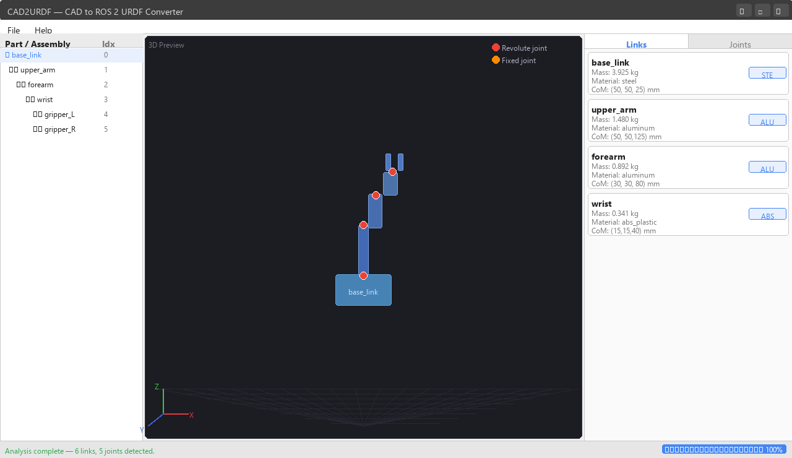
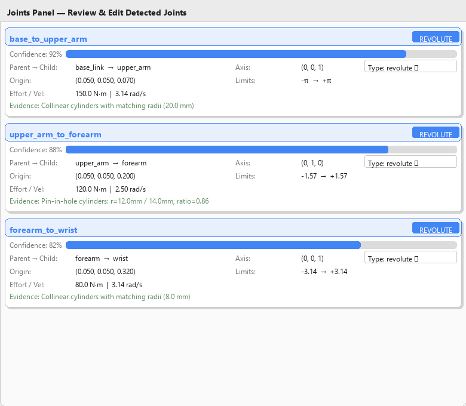
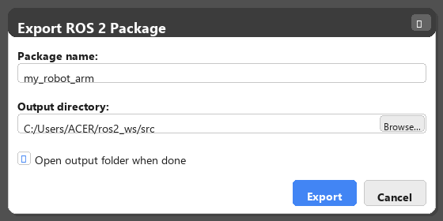
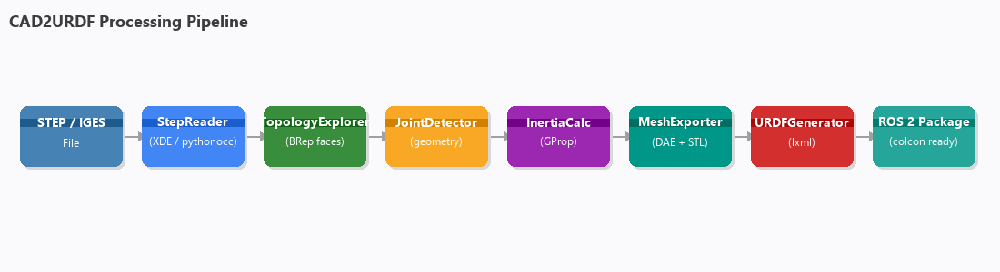
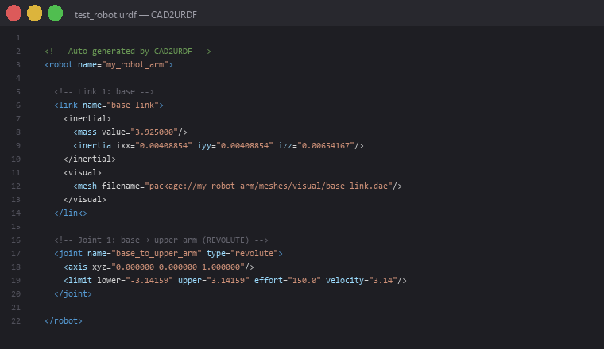

# CAD2URDF

**Convert CAD assembly files (STEP / IGES) into complete, simulation-ready ROS 2 URDF packages — automatically.**

CAD2URDF is an open-source desktop application that reads your mechanical CAD assembly, detects kinematic joints from geometry, calculates physically accurate inertial properties, exports optimised meshes, and produces a fully structured ROS 2 package ready to build with `colcon`.

---

## Screenshots

### Main Window
Three-panel layout: assembly tree on the left, 3D preview in the centre, Links / Joints inspector on the right.



---

### Joints Inspector
Every detected joint shows its type, confidence score, axis, limits, and the geometric evidence that triggered the classification. All fields are editable before export.



---

### Export Dialog
Set the ROS 2 package name and output directory. The generated package drops straight into any `colcon` workspace.



---

### Processing Pipeline



---

### Generated URDF Output
Calibrated inertia tensors, mesh references, joint axes, and limits — all auto-generated.



---

## Features

| Category | Detail |
|---|---|
| **Input formats** | STEP (`.step`, `.stp`), IGES (`.iges`, `.igs`) |
| **Assembly reading** | Full XDE hierarchy via pythonocc — preserves part names, sub-assemblies, transforms |
| **Joint detection** | Automatic revolute / prismatic / fixed from cylindrical BRep face geometry |
| **Confidence scoring** | 0–100 % confidence score + human-readable geometric evidence per joint |
| **Inertial properties** | Mass, centre of mass, full 3×3 inertia tensor from GProp volume integration |
| **Material library** | Steel, aluminium, ABS plastic, titanium, carbon fibre, brass, PLA |
| **Mesh export** | Visual `.dae` (Collada, full detail) and collision `.stl` (quadric decimation) |
| **URDF generation** | Complete `<link>` / `<joint>` tree with `<inertial>`, `<visual>`, `<collision>`, limits, dynamics |
| **ROS 2 package** | `package.xml`, `CMakeLists.txt`, `display.launch.py`, `gazebo.launch.py`, `controllers.yaml`, Gazebo world |
| **GUI** | PyQt5 — assembly tree, PyVista 3D viewer, per-link and per-joint edit panels, progress bar |

---

## Project Structure

```
cad2urdf/
├── main.py                      # Entry point — launches PyQt5 GUI
├── requirements.txt
├── setup.py
│
├── core/
│   ├── step_reader.py           # STEP/IGES parser (pythonocc XDE)
│   ├── assembly_analyzer.py     # Assembly tree builder
│   ├── topology_explorer.py     # BRep face classification
│   ├── joint_detector.py        # Revolute / prismatic / fixed detection
│   ├── axis_calculator.py       # Joint axis and frame computation
│   ├── inertia_calculator.py    # Mass, CoM, inertia tensor
│   ├── mesh_exporter.py         # DAE (visual) + STL (collision) export
│   ├── mesh_simplifier.py       # Quadric decimation via trimesh
│   ├── urdf_generator.py        # URDF XML builder (lxml)
│   └── ros_package_builder.py   # Complete ROS 2 package generator
│
├── gui/
│   ├── main_window.py           # Main window, menu, layout, worker threads
│   ├── viewer_3d.py             # PyVista 3D viewer embedded in PyQt5
│   ├── assembly_tree_widget.py  # QTreeWidget — assembly hierarchy
│   ├── joint_panel.py           # Joint review / edit panel
│   ├── link_panel.py            # Link mass / material panel
│   └── export_dialog.py         # Export settings dialog
│
└── utils/
    ├── geometry_utils.py        # Vector math, axis alignment helpers
    ├── urdf_validator.py        # Structural URDF validation
    └── logger.py                # Loguru-based unified logger
```

---

## Installation

### Requirements

| Dependency | Version | Note |
|---|---|---|
| Python | 3.10 – 3.12 | **Not** 3.13+ (pythonocc constraint) |
| pythonocc-core | 7.7.2 | Must install via **conda-forge** |
| PyQt5 | 5.15.10 | |
| pyvista | 0.43.0 | |
| pyvistaqt | 0.11.0 | |
| trimesh | 4.3.2 | |
| numpy | 1.26.4 | |
| lxml | 5.2.1 | |
| scipy | 1.13.0 | |
| loguru | 0.7.2 | |
| pycollada | latest | DAE export |
| networkx | latest | trimesh dependency |

### Step 1 — Create a conda environment with Python 3.12

pythonocc-core is only on conda-forge and requires Python ≤ 3.12.

```bash
conda create -n cad2urdf python=3.12 -y
conda activate cad2urdf
```

### Step 2 — Install pythonocc from conda-forge

```bash
conda install -c conda-forge pythonocc-core=7.7.2 -y
```

### Step 3 — Install remaining dependencies via pip

```bash
pip install PyQt5==5.15.10 pyvista==0.43.0 pyvistaqt==0.11.0 \
            trimesh==4.3.2 numpy==1.26.4 lxml==5.2.1 \
            scipy==1.13.0 loguru==0.7.2 pycollada networkx
```

### Step 4 — Clone and run

```bash
git clone https://github.com/jaafar1712/cad-to-urdf.git
cd cad-to-urdf
python main.py
```

---

## Usage

### GUI workflow

1. **File → Open CAD File** — select a `.step` or `.stp` file
2. The pipeline runs in a background thread (progress bar at the bottom)
3. Review the assembly tree on the left and 3D preview in the centre
4. Open the **Links** tab — verify masses, change materials
5. Open the **Joints** tab — review joint types, axes, limits; edit any field inline
6. **File → Export ROS 2 Package** — set a package name and output directory
7. Build and launch in ROS 2:

```bash
cd ~/ros2_ws
colcon build --packages-select my_robot_arm
source install/setup.bash

# Visualise in RViz2
ros2 launch my_robot_arm display.launch.py

# Spawn in Gazebo
ros2 launch my_robot_arm gazebo.launch.py
```

### CLI / headless pipeline

Run the full pipeline without opening the GUI:

```bash
python test_full_pipeline.py
```

---

## How Joint Detection Works

The detector analyses the BRep topology of every part and compares cylindrical face geometry between adjacent links:

```
REVOLUTE  — two parts share a collinear cylinder axis (same line in 3D)
             Confidence 92% : matching radii (shaft-in-shaft)
             Confidence 82% : pin-in-hole (radius ratio 0.7 – 1.0)
             Confidence 70% : collinear axes, large radius mismatch

PRISMATIC — two parts share a parallel but non-collinear cylinder axis
             Confidence 65%

FIXED     — no matching cylindrical geometry found (conservative default)
             Confidence 50%
```

Every joint card in the GUI shows the raw geometric evidence so you can verify or override the classification before export.

---

## Generated Package Layout

```
my_robot_arm/
├── package.xml
├── CMakeLists.txt
├── urdf/
│   └── my_robot_arm.urdf        # Full URDF with inertia, meshes, joints
├── meshes/
│   ├── visual/                  # .dae files — Collada, full detail
│   └── collision/               # .stl files — simplified for physics
├── launch/
│   ├── display.launch.py        # RViz2 + joint_state_publisher_gui
│   └── gazebo.launch.py         # Gazebo Classic spawn
├── config/
│   └── controllers.yaml         # ros2_control joint trajectory controller
└── worlds/
    └── empty.world              # Ground plane + sun
```

---

## Technology Stack

| Layer | Library |
|---|---|
| CAD kernel | [pythonocc-core](https://github.com/tpaviot/pythonocc-core) (OpenCASCADE 7.7) |
| Assembly reading | XCAFDoc / STEPCAFControl XDE framework |
| Inertia integration | BRepGProp volume properties |
| Mesh processing | [trimesh](https://trimesh.org/) + pycollada |
| 3D visualisation | [PyVista](https://pyvista.org/) + pyvistaqt |
| GUI framework | [PyQt5](https://riverbankcomputing.com/software/pyqt/) |
| XML generation | [lxml](https://lxml.de/) |
| Logging | [loguru](https://loguru.readthedocs.io/) |

---

## Testing

Each module has a dedicated test script:

```bash
python test_generator.py        # Create test_arm.step (2-link arm)
python test_step_reader.py      # XDE part extraction
python test_topology.py         # BRep face classification
python test_joint_detector.py   # Joint type detection
python test_inertia.py          # Mass and inertia tensor values
python test_mesh_exporter.py    # DAE and STL export
python test_urdf_generator.py   # URDF generation + validation
python test_full_pipeline.py    # End-to-end (all 9 stages)
```

All 9 stages of `test_full_pipeline.py` pass on the included test geometry.

---

## Known Limitations

- **Joint detection requires cylindrical geometry at the interface.** A revolute joint is only detected when both mating parts expose cylindrical faces along the same axis (pin through a hole). Parts joined by prismatic guides, keys, or splines without cylindrical faces will default to `fixed` — override them manually in the Joints panel.
- **STEP files without named parts** produce auto-generated names (`part_0`, `part_1`, …). Re-export from your CAD tool with descriptive component names for cleaner results.
- **pythonocc-core requires Python ≤ 3.12** — install via conda-forge, not pip.
- **The 3D viewer** requires an OpenGL-capable display. It falls back to a placeholder label in headless/CI environments.

---

## License

Apache 2.0 — see [LICENSE](LICENSE).
